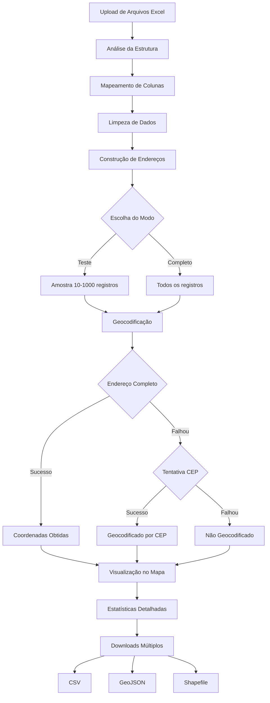

# 📍 Geocodificador de CNPJs - Espírito Santo

**Desenvolvido por: Leonardo Rocha | UFES | Julho 2025**

Aplicativo Streamlit para geocodificação automatizada de dados de estabelecimentos CNPJ do Espírito Santo, utilizando inteligência para construção de endereços e geocodificação com fallback por CEP.

Link Streamlit: https://geolocalizacaoufes.streamlit.app/

---

## 🎯 Como Funciona

### 📊 Processamento Inteligente dos Dados

O aplicativo resolve um problema específico: os arquivos CNPJ vêm com colunas codificadas (`"V12"`, `"V14"`, etc.) que precisam ser interpretadas corretamente para construir endereços válidos.

**Estrutura dos Dados CNPJ:**

| Código | Campo | Descrição | Exemplo |
|--------|-------|-----------|---------|
| V12 | codigo_municipio | Código do município | "5201405" |
| V14 | tipo_logradouro | Tipo de logradouro | "RUA", "AVENIDA" |
| V15 | logradouro | Nome da rua/avenida | "SANTOS NEVES" |
| V16 | numero | Número do endereço | "104", "S/N" |
| V18 | complemento | Bairro/complemento | "MAUA", "CENTRO" |
| V19 | cep | CEP | "29730000" |
| V21 | codigo_bairro | Código do bairro | "5691" |

### 🏗️ Construção Inteligente de Endereços

O app combina automaticamente os campos para formar endereços completos:

```
Input:  V14="RUA" + V15="SANTOS NEVES" + V16="104" + V18="MAUA"
Output: "RUA SANTOS NEVES, 104, MAUA, Espírito Santo, Brasil"
```

**Regras de Limpeza:**
- Remove aspas extras: `"RUA"` → `RUA`
- Ignora números inválidos: `S/N`, `SN` (não adiciona ao endereço)
- Trata valores vazios e NaN apropriadamente
- Adiciona localização padrão: `Espírito Santo, Brasil`

---

## 🔄 Fluxo de Funcionamento



### 📋 Etapas Detalhadas

1. **Upload e Análise**
   - Carrega arquivos `.xlsx` via interface web
   - Identifica automaticamente a estrutura CNPJ
   - Mapeia colunas codificadas para nomes legíveis

2. **Processamento de Dados**
   - Remove caracteres especiais e aspas
   - Valida tipos de dados
   - Unifica múltiplos arquivos em um dataset

3. **Construção de Endereços**
   - Combina: `tipo_logradouro + logradouro + numero + complemento`
   - Filtra números inválidos (S/N, SN)
   - Adiciona localização geográfica padrão

4. **Geocodificação Dupla**
   - **Estratégia 1**: Endereço completo via Nominatim, Photon e ArcGIS
   - **Estratégia 2**: Fallback por CEP usando as mesmas APIs
   - Rate limiting: 1 requisição/segundo (evita bloqueios)

5. **Visualização Interativa**
   - Mapa centralizado no Espírito Santo
   - Marcadores coloridos por método de geocodificação:
     - 🟢 Verde: Endereço completo
     - 🟠 Laranja: CEP
     - 🔴 Vermelho: Falhou
   - Popups com informações detalhadas

6. **Exportação Multi-formato**
   - **CSV**: Tabela com coordenadas
   - **GeoJSON**: Formato web padrão
   - **Shapefile**: Padrão GIS (.shp, .shx, .dbf, .prj)

---

## 🌐 APIs Utilizadas

- **Nominatim (OpenStreetMap):** Geocodificação gratuita e aberta
- **Photon:** Alternativa baseada em OpenStreetMap
- **ArcGIS:** Geocodificação gratuita limitada

---

## 🎮 Como Usar

### 📋 Pré-requisitos
- Python 3.8+
- Conexão com internet (para geocodificação)
- Arquivos CNPJ do ES em formato Excel (.xlsx)

### 🚀 Instalação e Execução Local

#### 1. **Preparação do Ambiente**

```bash
# Clone ou baixe o projeto
cd C:\Users\seu-usuario\projetos\

# Navegue para o diretório
cd geolocalizacao_ufes_streamlit
```

#### 2. **Instalação das Dependências**

```bash
# Instale as bibliotecas necessárias
pip install -r requirements.txt
```

**Principais dependências:**
- `streamlit` - Framework web
- `pandas` - Manipulação de dados
- `folium` - Mapas interativos
- `geopandas` - Dados geoespaciais
- `geopy` - Geocodificação
- `openpyxl` - Leitura de Excel
- `shapely` - Geometrias

#### 3. **Execução do Aplicativo**

```bash
# Execute o Streamlit
streamlit run app.py
```

#### 4. **Acesso via Navegador**

O aplicativo abrirá automaticamente em:
- **Local**: http://localhost:8501
- **Rede**: http://SEU-IP:8501

---

## 💻 Interface do Usuário

### 📁 **Passo 1: Upload de Arquivos**
1. Clique em "Browse files" ou arraste os arquivos
2. Selecione: `CNPJs_ES_P1_V2.xlsx` e `CNPJs_ES_P2_V2.xlsx`
3. Aguarde o processamento automático

### 📊 **Passo 2: Verificação dos Dados**
- Visualize a prévia dos dados processados
- Confira as estatísticas:
  - Total de registros
  - Registros com endereço
  - Registros com CEP

### ⚙️ **Passo 3: Configuração**
- **Modo Teste**: 10-1000 registros (recomendado para primeiro uso)
- **Modo Completo**: Todos os ~146.000 registros (pode demorar 30-60 min)

### 🚀 **Passo 4: Geocodificação**
1. Clique em "🚀 Iniciar Geocodificação"
2. Acompanhe o progresso em tempo real
3. Veja estatísticas de sucesso

### 🗺️ **Passo 5: Visualização**
- Explore o mapa interativo
- Clique nos marcadores para ver detalhes
- Use zoom e pan para navegação

### 📥 **Passo 6: Download**
- **CSV**: Para análise em Excel/Python
- **GeoJSON**: Para aplicações web
- **Shapefile**: Para softwares GIS (QGIS, ArcGIS)

---

## 📊 Resultados Esperados

### Taxa de Sucesso Típica
- **Endereço Completo**: 60-70% dos registros
- **CEP**: 20-30% adicional
- **Total**: 80-90% de geocodificação

### Exemplo de Dados Processados
```csv
id,endereco_completo,latitude,longitude,geocoding_method,geocoding_status
1,"RUA SANTOS NEVES, 104, MAUA, Espírito Santo, Brasil",-20.123,-40.456,Endereço completo,Sucesso
2,"AVENIDA BRASIL, 200, CENTRO, Espírito Santo, Brasil",-20.134,-40.467,Endereço completo,Sucesso
3,"CEP 29730-000, Espírito Santo, Brasil",-20.145,-40.478,CEP,Sucesso
```

---

## 🔧 Configurações Avançadas

### ⚡ Performance
- **Amostragem**: Use amostras de 100-500 registros para testes
- **Rate Limiting**: 1 req/seg (pode ser ajustado no código)
- **Cache**: Dados carregados ficam em cache para reprocessamento

### 🌐 Geocodificação
- **Provedores**: Nominatim, Photon, ArcGIS
- **Timeout**: 10 segundos por requisição
- **Retry**: Backoff exponencial automático

### 💾 Armazenamento
- **Dados temporários**: Removidos após sessão
- **Downloads**: Gerados em tempo real
- **Cache**: Apenas durante a sessão ativa

---

## 🔍 Troubleshooting

### ❓ Problemas Comuns

**1. Erro "File does not exist"**
```bash
# Certifique-se de estar no diretório correto
cd C:\Users\leona\OneDrive\Documentos\CursorIA\geolocalizacao_ufes_streamlit
```

**2. Erro de módulos não encontrados**
```bash
pip install -r requirements.txt
```

**3. Erro de permissão ao baixar arquivos**
- Execute o navegador como administrador
- Verifique permissões da pasta de destino

---

## 📢 Contato

Dúvidas, sugestões ou bugs? Abra uma issue no GitHub ou envie e-mail para leonardorochadf@gmail.com

---

## 🏛️ UFES - Universidade Federal do Espírito Santo

Sistema desenvolvido para apoio a projetos de pesquisa e extensão. 